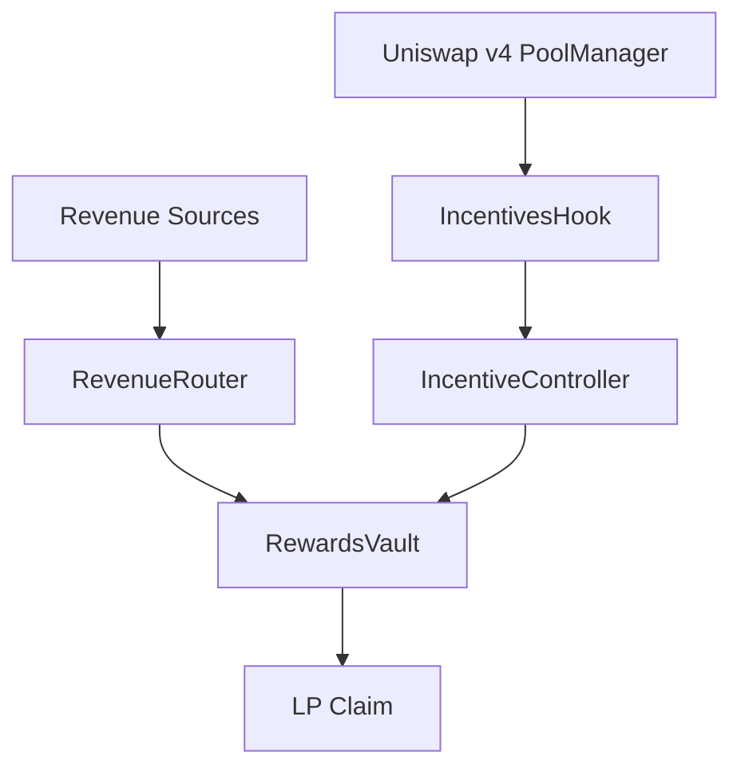
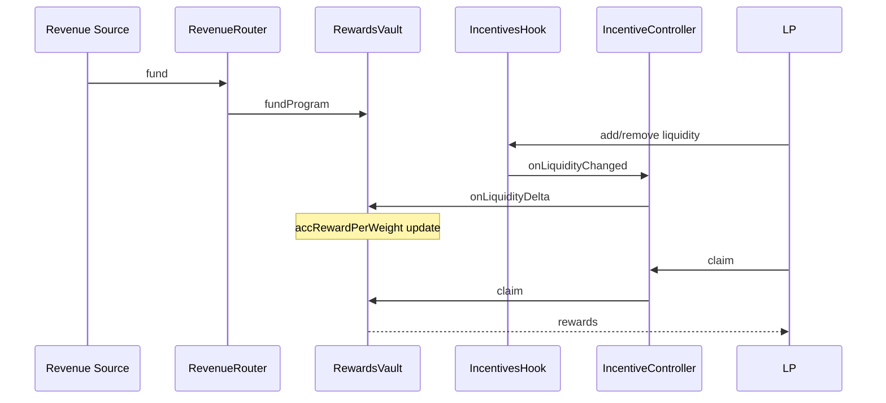
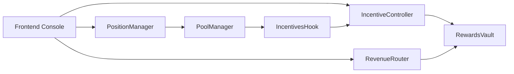

# ERD-Hook: External Revenue-Driven Liquidity Incentives for Uniswap v4


A production-oriented Uniswap v4 hook + incentive controller that routes external/protocol revenue into deterministic LP rewards.

## Why This Exists

Traditional liquidity mining emissions are often disconnected from real revenue.
ERD-Hook binds incentive funding to explicit revenue streams:

- Direct sponsor/protocol funding.
- Adapter-driven external revenue.
- Deterministic, on-chain reward accounting.

## Core Contracts

- `src/IncentivesHook.sol`
- `src/IncentiveController.sol`
- `src/RevenueRouter.sol`
- `src/RewardsVault.sol`
- `src/libraries/WeightingLibrary.sol`
- `src/mocks/MockRevenueAdapter.sol`

## Visual Architecture







## Incentive Modes

1. Continuous streaming rewards.
2. Epoch-based distribution windows.

Both use accumulator math (`accRewardPerWeightX18`) and O(1) claim paths.

## Anti-Manipulation Features

- Warm-up gate before weight activation.
- Cooldown-based early withdrawal penalty.
- No all-user loops.
- Controller update delays (queue/execute).

## Quick Start

### 1) Bootstrap dependencies

```bash
make bootstrap
```

This enforces Uniswap v4 dependency pinning (periphery commit `3779387`).

### 2) Build and test

```bash
make build
make test
make coverage
```

### 3) Run frontend

```bash
npm install
npm run abi:export
npm run abi:sync
npm run dev
```

## Demo Commands

```bash
make demo-local
make demo-streaming
make demo-epoch
make demo-all
```

Testnet (Base Sepolia default):

```bash
cp .env.example .env
source .env
MODE=streaming make demo-testnet
MODE=epoch make demo-testnet
```

## Demo Narrative (Judge Flow)

1. Deploy ERD contracts + mock assets + v4 pool.
2. Configure a program for the hook-linked pool.
3. Fund via direct sponsor and adapter revenue.
4. LP A adds liquidity; LP B adds later.
5. Swap activity is recorded by the hook.
6. LPs claim deterministically accrued rewards.
7. Output shows funded totals, claim totals, and slashed penalties.

## Deployment Artifacts

Broadcast outputs are generated to `broadcast/`.

### Addresses

- Local Anvil: generated per run (see `broadcast/.../run-latest.json`)
- Base Sepolia: TBD (run `make demo-testnet`)

### Explorer Links

- If `EXPLORER_TX_BASE` is configured, links are printed.
- Otherwise output prints `TBD (chain-specific) + tx hash`.

## Repository Structure

- `.github/workflows/`
- `.vscode/`
- `assets/`
- `context/`
- `docs/`
- `frontend/`
- `lib/`
- `script/`
- `scripts/`
- `src/`
- `test/`
- `shared/`

## Documentation Index

- [docs/overview.md](docs/overview.md)
- [docs/architecture.md](docs/architecture.md)
- [docs/incentive-model.md](docs/incentive-model.md)
- [docs/revenue-routing.md](docs/revenue-routing.md)
- [docs/security.md](docs/security.md)
- [docs/deployment.md](docs/deployment.md)
- [docs/demo.md](docs/demo.md)
- [docs/api.md](docs/api.md)
- [docs/testing.md](docs/testing.md)
- [docs/frontend.md](docs/frontend.md)

## Security Notes

See `SECURITY.md` for threat model, mitigations, and residual risks.
