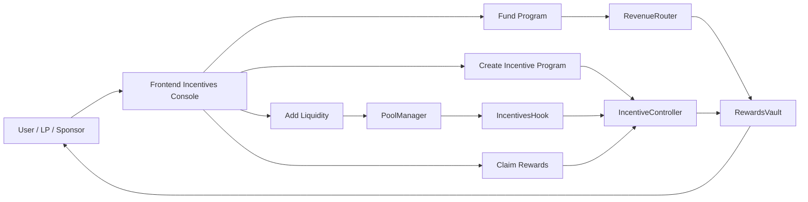
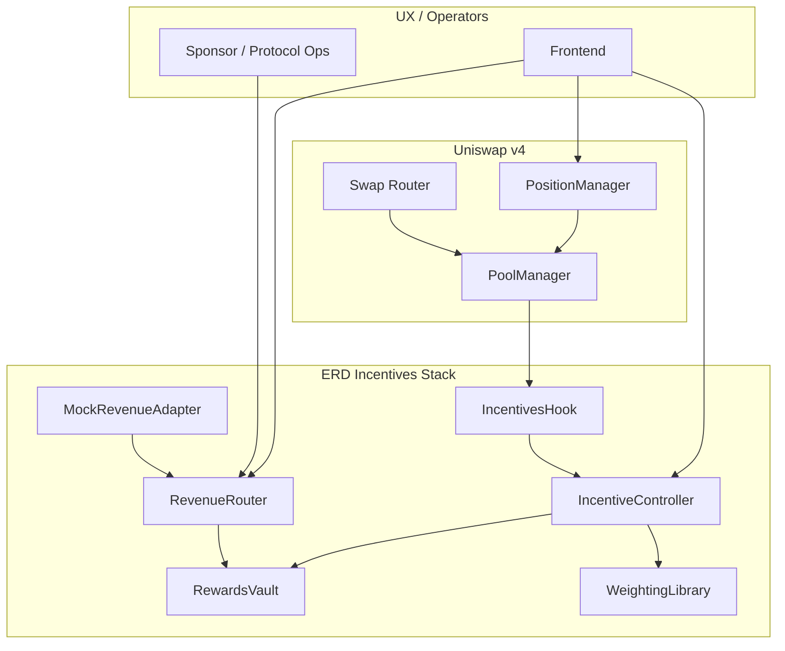
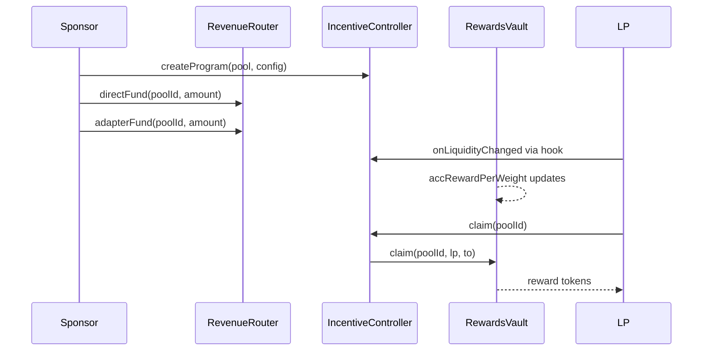

# ERD-Hook: External Revenue-Driven Liquidity Incentives for Uniswap v4

[](https://github.com/blue-benz/ERD-Hook/actions/workflows/test.yml)
[](#100-forge-coverage-proof)
[](https://soliditylang.org/)
[](https://book.getfoundry.sh/)
[](https://sepolia.uniscan.xyz/)
[](LICENSE)


ERD-Hook is a production-focused Uniswap v4 incentives system that routes external/protocol revenue into deterministic, on-chain LP rewards.

## Description

ERD-Hook introduces a reusable primitive for protocol-funded liquidity: revenue enters through auditable funding paths, reward accounting is deterministic, and LP claims are loop-free and on-chain.

## Problem

Most LP incentive systems have one or more of these failures:

- Funding is disconnected from real protocol revenue.
- Reward accounting is opaque or off-chain.
- Mercenary liquidity can farm emissions with fast in/out behavior.
- Distribution designs rely on unbounded loops or fragile bookkeeping.

## Solution

ERD-Hook solves this with a hook-centric incentives architecture:

- External revenue enters via `RevenueRouter` (direct sponsor funding + adapter funding).
- `IncentiveController` configures and governs pool programs.
- `IncentivesHook` updates contribution signals from v4 lifecycle events.
- `RewardsVault` performs accumulator-based accounting and O(1) claims.
- Anti-gaming controls are enforced on-chain (warm-up and cooldown penalty).

Supported program types:

1. Continuous streaming rewards.
2. Epoch-based rewards.

## Integrations

This repository integrates:

- Uniswap v4 Core and Periphery.
- Unichain Sepolia deployment path.
- Foundry-based deploy/test/demo pipeline.

Reactive Network integration is not present in this codebase and is intentionally not configured.

## Major Components

- `src/IncentivesHook.sol`: Hook entrypoints, PoolManager-gated accounting updates.
- `src/IncentiveController.sol`: Program creation, updates, epoch rolls, claims routing.
- `src/RevenueRouter.sol`: Revenue ingress, adapter allowlist, funding routes.
- `src/RewardsVault.sol`: Funding custody, reward accumulators, claim settlement.
- `src/libraries/WeightingLibrary.sol`: Deterministic weighting + penalty math.
- `src/mocks/MockRevenueAdapter.sol`: Demo revenue source.
- `frontend/`: Incentives console for config/funding/state/claims.

## Diagrams and Flowcharts

### User Perspective Flow



### Architecture Flow (Subgraphs)



### Incentive Lifecycle Sequence



## Deployed Addresses with Tx URLs (Unichain Sepolia)

Latest full-lifecycle demo deployments (March 10, 2026).

These were executed with `TESTNET_DEPLOY_ONLY=false` and include deploy, fund, LP add, swap, and claim on-chain.

#### Streaming (Full Lifecycle)

| Component | Address | Deployment Tx URL |
| --- | --- | --- |
| IncentivesHook | `0xb4C6b1481C38333834aA784c3210979E95090aC0` | https://sepolia.uniscan.xyz/tx/0x3a2ea526e9f5c33c4dcc0a113ad38dfc215d4861bbf45ee4626f1b658870d173 |
| IncentiveController | `0xCC435Bdd95e20fe41D3705DE3Af39fCBeACfFD7E` | https://sepolia.uniscan.xyz/tx/0x8556dd69fbcd06192d3c079af2d1a1dae0b3e5c190ef51578c1a2556e28f02d8 |
| RevenueRouter | `0xFD1381fbeC17E10B6aFA078ed16FfF952EE68f21` | https://sepolia.uniscan.xyz/tx/0xb972353ab7b3e7e6e2d144af1379226cc92ca14423ed81dad04545adea12a870 |
| RewardsVault | `0xdE398Eb17Ce389db5BC823Ed93d3e8f8bC10a484` | https://sepolia.uniscan.xyz/tx/0x41024514cd96dcb98268e29946ac9a903bbf9c1cff6f752551980b70429597d8 |
| MockRevenueAdapter | `0x3DE0f341D689dc066DC2EBf816150E1B6a077497` | https://sepolia.uniscan.xyz/tx/0x9f9ad1dd3414b2f2b8ccdff77558228af81d5bc767d4aa42747f266baccd33c1 |
| Reward Token | `0x314ed6eE271534426E358a3Daf3eCddEE034Edf1` | https://sepolia.uniscan.xyz/tx/0x0bf7a6182ec0088da525f9b90ed3589f2b3fec513baef314511043b66d01b2f5 |

Streaming full-demo tx URLs (proof path):

- Program creation: https://sepolia.uniscan.xyz/tx/0x0f299589dd15f06954bbf1fb8dd09447f2c9496e5967031433ed5e8468d502d8
- Direct funding: https://sepolia.uniscan.xyz/tx/0xa0d69dffc1cd244fba0a2b880b537ce8b47db124dd3b2492186be5cca0b2a7ee
- Adapter routing: https://sepolia.uniscan.xyz/tx/0x06f1f7b5ded6b8d5c000ffdb766f98f070fb62303103eb384b9c2b089f94844c
- LP A add-liquidity: https://sepolia.uniscan.xyz/tx/0x7daa0612ab5b98bc6298155ab7692d9826008b647e0ac510f0e84ef6ac2efe7e
- LP B add-liquidity: https://sepolia.uniscan.xyz/tx/0x313c8a2b2084a82e008eaa27bcbd122cb1b5c4d8f6610bb9b4c5b22408034a7a
- Swap activity: https://sepolia.uniscan.xyz/tx/0x6486a51dcfb761215ae4f5d6cdd754a5f24490f94e2d35d84e88d9a92b1fa71e
- Claim LP A: https://sepolia.uniscan.xyz/tx/0xee9dc6cf7437fe88006e15e83718891d31beead5aad4d0491aafc9fd89e0113f
- Claim LP B: https://sepolia.uniscan.xyz/tx/0x29be09b9e9b3683511197be7b46807b4165aad25297a2ddd405f76025f4cde9e

#### Epoch (Full Lifecycle)

| Component | Address | Deployment Tx URL |
| --- | --- | --- |
| IncentivesHook | `0xB44eCe25A4D33e2e32be337E7f5f6b4771d30aC0` | https://sepolia.uniscan.xyz/tx/0xb672880de9cd086fbbd1f97e95959ad992a56e6005eb54bf9a9d1347c63ee72b |
| IncentiveController | `0xFCcF2AC6A844F381018dA10D0E8f1F098864a804` | https://sepolia.uniscan.xyz/tx/0x14037dcd762e0d6eaa2f122f23b7f5e56db2e529d36dcbd5614a655e2ce9bca2 |
| RevenueRouter | `0xFdC9b1386CA5BB54DF2f4565706221070A838B0E` | https://sepolia.uniscan.xyz/tx/0xabf1d1761ff6fa207597a8873f1e3f05b6b620b0bf1a7f8bcdb58116094bf6c9 |
| RewardsVault | `0xB3D4e2dCd5F00628E43e6b448A0D278377eD0C50` | https://sepolia.uniscan.xyz/tx/0xaaad62a14c8010833d5faa033a81c8b75df2104935469b47056ad9b7d99f323f |
| MockRevenueAdapter | `0x043FE47065Ee008967728B0e4e8B73bbF7421585` | https://sepolia.uniscan.xyz/tx/0xee72857f8bc70c53e6b00d80a513f662e510f155455abc90c7d3ac405e1a9b73 |
| Reward Token | `0x3eDE13af71c1DF870bbD5396DB25144A8aDCbE6A` | https://sepolia.uniscan.xyz/tx/0x144ea1075a3da694f957e498b49ee26ab52931e037a7447ce35c3ba4919f81e3 |

Epoch full-demo tx URLs (proof path):

- Program creation: https://sepolia.uniscan.xyz/tx/0x661903ebb884668fb180d7afea19ba8b5fed403609fbe113bb3e2f2471d619dd
- Direct funding: https://sepolia.uniscan.xyz/tx/0xd01d7a97cd82420635d6e080490cd600d51c664e406a7071204a66755e0722d3
- Adapter routing: https://sepolia.uniscan.xyz/tx/0xa537e9692381a57a6a82bf31191dbbd83fc71619939b7a3403fbc27bcccdfda4
- LP A add-liquidity: https://sepolia.uniscan.xyz/tx/0x4ef10eaeaa6a84d818977c9fc683388f6307b03dad84d96157a4c070a1d056c3
- LP B add-liquidity: https://sepolia.uniscan.xyz/tx/0x91726886b7a3af22b758a81b78c691d79c1bf151552503caab5d7f4684ea97c5
- Swap activity: https://sepolia.uniscan.xyz/tx/0x0d35afd1aa03191c2262189b63fd109aab5b97db87bf7ced7921993b8cec65fc
- Claim LP A: https://sepolia.uniscan.xyz/tx/0x2dd314cd6fc5fb91c4216ef071d4ed77977ee4ab7bfccc4f117ce73ba89dc0a9
- Claim LP B: https://sepolia.uniscan.xyz/tx/0xac495e1c97e41205499aa1b500212e6e23b87e3cc137e574deafd4401007e3f9

For every tx URL in each run (not just key checkpoints), run:

```bash
./scripts/print_broadcast_summary.sh 10_DemoStreaming.s.sol 1301 https://sepolia.uniscan.xyz/tx "$SEPOLIA_RPC_URL"
./scripts/print_broadcast_summary.sh 11_DemoEpoch.s.sol 1301 https://sepolia.uniscan.xyz/tx "$SEPOLIA_RPC_URL"
```

## Demo Run

### Full Lifecycle Demo (Local)

- `scripts/demo-streaming.sh`
- `scripts/demo-epoch.sh`
- `scripts/demo-local.sh`

These run the full lifecycle: deploy -> configure -> fund -> LP A joins -> LP B joins -> swap -> claim.

`scripts/demo-local.sh` runs streaming and epoch on isolated Anvil nodes (`--block-time 1`) to avoid CREATE2 collisions and ensure deterministic local accrual.

### Testnet Demo (Unichain Sepolia)

- `scripts/demo-testnet.sh` defaults to `TESTNET_DEPLOY_ONLY=true` for stable broadcast sequencing.
- Set `TESTNET_DEPLOY_ONLY=false` to run full lifecycle on public RPC.

Tx URLs are printed automatically by `scripts/print_broadcast_summary.sh`.
The script also prints an on-chain `Claim Event Summary` (decoded from tx receipts), which is the authoritative proof of claimed amounts.

## Commands to Run

```bash
make bootstrap
make build
make test

# Full local lifecycle demos
make demo-streaming
make demo-epoch
make demo-local
make demo-all

# Unichain Sepolia deploy-only demos (default)
MODE=streaming ./scripts/demo-testnet.sh
MODE=epoch ./scripts/demo-testnet.sh

# Full public lifecycle demos
TESTNET_DEPLOY_ONLY=false MODE=streaming ./scripts/demo-testnet.sh
TESTNET_DEPLOY_ONLY=false MODE=epoch ./scripts/demo-testnet.sh
```

## 100% Forge Coverage Proof

Coverage command used:

```bash
forge coverage --report summary --no-match-coverage "script|test"
```

Latest result (March 10, 2026):

- Total Lines: `100.00% (348/348)`
- Total Statements: `100.00% (387/387)`
- Total Branches: `100.00% (66/66)`
- Total Funcs: `100.00% (63/63)`

Test categories included:

- Unit tests.
- Edge case tests.
- Fuzz/invariant tests.
- Integration/system tests.
- Library behavior tests.

## Future Roadmap

1. Add additional production revenue adapters (beyond mock adapter).
2. Add richer frontend fairness analytics and LP attribution breakdowns.
3. Introduce governance delay/timelock hardening for sensitive config updates.
4. Extend anti-gaming invariants and MEV-aware stress scenarios.
5. Publish post-deploy monitoring runbook and alerting checklist.

## Documentation

- [docs/overview.md](docs/overview.md)
- [docs/architecture.md](docs/architecture.md)
- [docs/incentive-model.md](docs/incentive-model.md)
- [docs/revenue-routing.md](docs/revenue-routing.md)
- [docs/security.md](docs/security.md)
- [docs/deployment.md](docs/deployment.md)
- [docs/demo.md](docs/demo.md)
- [docs/api.md](docs/api.md)
- [docs/testing.md](docs/testing.md)
- [docs/frontend.md](docs/frontend.md)
