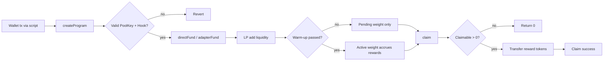
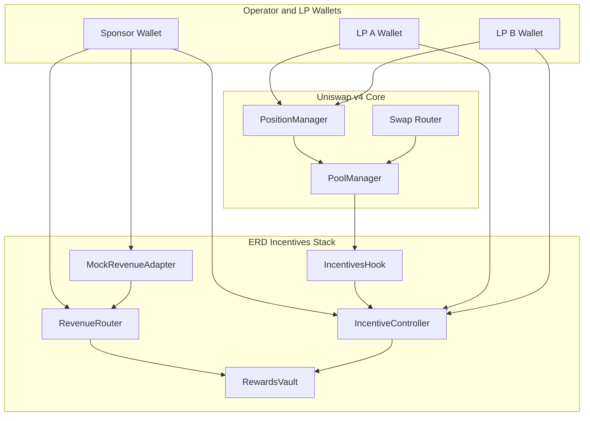
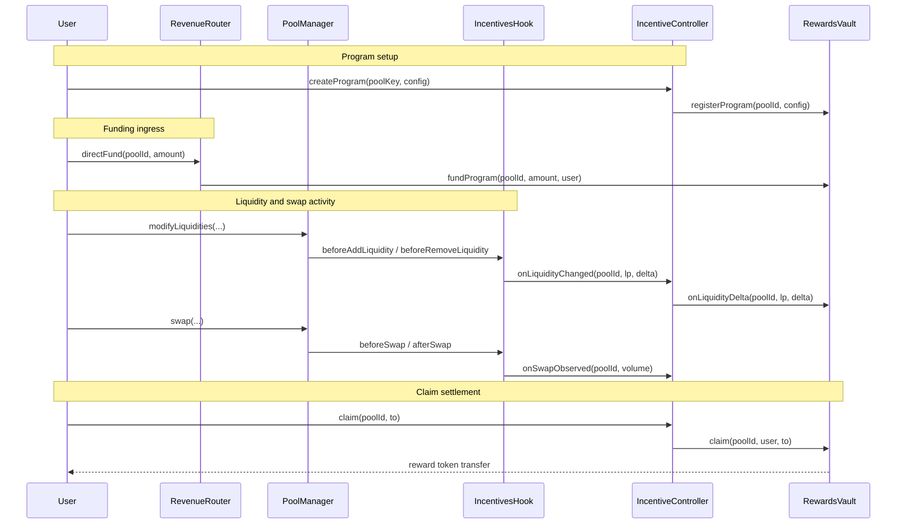

# ERD-Hook
**Built on Uniswap v4 · Deployed on Unichain Sepolia**

_Targeting: Uniswap Foundation Prize · Unichain Prize_

> Deterministic on-chain liquidity incentives for Uniswap v4 pools funded by external or protocol-level revenue.

[](https://github.com/blue-benz/ERD-Hook/actions/workflows/test.yml)
[](#test-coverage)
[](https://soliditylang.org/)
[](https://docs.uniswap.org/contracts/v4/overview)
[](https://sepolia.uniscan.xyz/)


## The Problem
Liquidity incentives usually fail because funding, accounting, and execution are disconnected.

| Layer | Failure Mode |
| --- | --- |
| Revenue source | Incentive budgets are not tied to real protocol/external cash flow. |
| Reward accounting | Off-chain spreadsheets or snapshots create trust assumptions and disputes. |
| LP behavior | Fast add/remove strategies farm emissions without sustained liquidity. |
| Claim path | Designs that iterate over LP sets become expensive and fragile. |

These failure modes reduce capital efficiency and make incentive outcomes hard to audit.

## The Solution
ERD-Hook routes external revenue into deterministic reward accounting, enforced entirely on-chain.

1. `IncentiveController.createProgram(...)` registers a pool-specific reward policy (streaming or epoch).
2. `RevenueRouter.directFund(...)` and `RevenueRouter.adapterFund(...)` move reward tokens into `RewardsVault`.
3. `IncentivesHook` receives Uniswap v4 callbacks and forwards deterministic liquidity/swap observations.
4. `RewardsVault` updates accumulator state (`accRewardPerWeightX18`) with no LP loops.
5. LPs claim through `IncentiveController.claim(...)`, which settles and transfers from `RewardsVault`.
6. Warm-up and cooldown penalties reduce rapid in/out farming behavior.

Core insight: if funding ingress and reward settlement are both on-chain and bounded, incentive fairness is verifiable instead of inferred.

## Integrations
- Uniswap v4 (hooks, PoolManager callback path, PoolKey/PoolId accounting)
- Unichain Sepolia (live deployment and on-chain demo proof)

## Major Components
| Contract | Responsibility |
| --- | --- |
| `IncentivesHook` | PoolManager-gated hook callbacks; reports liquidity and swap signals. |
| `IncentiveController` | Program registry, delayed config updates, and user claim entrypoint. |
| `RevenueRouter` | Direct sponsor funding plus approved adapter funding routes. |
| `RewardsVault` | Reward custody, accumulator accounting, and reentrancy-safe claims. |
| `WeightingLibrary` | Shared math: absolute values, penalty application, activation merge. |
| `MockRevenueAdapter` | Demo external revenue source calling adapter funding path. |

## Diagrams and Flowcharts
### User Perspective Flow


### Architecture Flow (Subgraphs)


### Interaction Sequence


## Incentive Regimes
| Regime | Time Model | Emissions | Claim Behavior | Anti-Gaming Controls |
| --- | --- | --- | --- | --- |
| `STREAMING` | Continuous | Per-second (`emissionRate`) while funded | Claim anytime; O(1) settlement | Warm-up + cooldown penalty |
| `EPOCH` | Discrete window | Per-second within `[startTime, endTime]` | Claim after accrual; epoch rollover explicit | Warm-up + cooldown penalty |

`EPOCH` constrains accrual to a configured window, while `STREAMING` stays open-ended until funding or config changes stop emissions.

## Deployed Contracts
### Unichain Sepolia (chainId 1301)
| Contract | Address |
| --- | --- |
| IncentivesHook | [`0xB44eCe25A4D33e2e32be337E7f5f6b4771d30aC0`](https://sepolia.uniscan.xyz/address/0xB44eCe25A4D33e2e32be337E7f5f6b4771d30aC0) |
| IncentiveController | [`0xFCcF2AC6A844F381018dA10D0E8f1F098864a804`](https://sepolia.uniscan.xyz/address/0xFCcF2AC6A844F381018dA10D0E8f1F098864a804) |
| RevenueRouter | [`0xFdC9b1386CA5BB54DF2f4565706221070A838B0E`](https://sepolia.uniscan.xyz/address/0xFdC9b1386CA5BB54DF2f4565706221070A838B0E) |
| RewardsVault | [`0xB3D4e2dCd5F00628E43e6b448A0D278377eD0C50`](https://sepolia.uniscan.xyz/address/0xB3D4e2dCd5F00628E43e6b448A0D278377eD0C50) |
| MockRevenueAdapter | [`0x043FE47065Ee008967728B0e4e8B73bbF7421585`](https://sepolia.uniscan.xyz/address/0x043FE47065Ee008967728B0e4e8B73bbF7421585) |
| Reward Token | [`0x3eDE13af71c1DF870bbD5396DB25144A8aDCbE6A`](https://sepolia.uniscan.xyz/address/0x3eDE13af71c1DF870bbD5396DB25144A8aDCbE6A) |

## Live Demo Evidence
Demo run date: **March 10, 2026**  
Network: **Unichain Sepolia (1301)**  
Script: `script/11_DemoEpoch.s.sol`

### Phase 1: Program Setup
| Action | Transaction |
| --- | --- |
| Pool initialization | [0xc6b49553…](https://sepolia.uniscan.xyz/tx/0xc6b49553092baa73ddf262859e4fd93c325e030432df6f36aad08bbe43c2ce96) |
| Program creation (`createProgram`) | [0x661903eb…](https://sepolia.uniscan.xyz/tx/0x661903ebb884668fb180d7afea19ba8b5fed403609fbe113bb3e2f2471d619dd) |

### Phase 2: Revenue Funding
| Action | Transaction |
| --- | --- |
| Direct sponsor funding (`directFund`) | [0xd01d7a97…](https://sepolia.uniscan.xyz/tx/0xd01d7a97cd82420635d6e080490cd600d51c664e406a7071204a66755e0722d3) |
| Adapter mints simulated revenue | [0x7c687782…](https://sepolia.uniscan.xyz/tx/0x7c687782a9913225950ad544e2c27daee13d9905603d82f51e027204e1ef10bf) |
| Adapter routes revenue (`routeRevenue`) | [0xa537e969…](https://sepolia.uniscan.xyz/tx/0xa537e9692381a57a6a82bf31191dbbd83fc71619939b7a3403fbc27bcccdfda4) |

### Phase 3: LP Activity and Claims
| Action | Transaction |
| --- | --- |
| LP A add liquidity | [0x4ef10eae…](https://sepolia.uniscan.xyz/tx/0x4ef10eaeaa6a84d818977c9fc683388f6307b03dad84d96157a4c070a1d056c3) |
| LP B add liquidity (later) | [0x91726886…](https://sepolia.uniscan.xyz/tx/0x91726886b7a3af22b758a81b78c691d79c1bf151552503caab5d7f4684ea97c5) |
| Swap execution | [0x0d35afd1…](https://sepolia.uniscan.xyz/tx/0x0d35afd1aa03191c2262189b63fd109aab5b97db87bf7ced7921993b8cec65fc) |
| LP A claim | [0x2dd314cd…](https://sepolia.uniscan.xyz/tx/0x2dd314cd6fc5fb91c4216ef071d4ed77977ee4ab7bfccc4f117ce73ba89dc0a9) |
| LP B claim | [0xac495e1c…](https://sepolia.uniscan.xyz/tx/0xac495e1c97e41205499aa1b500212e6e23b87e3cc137e574deafd4401007e3f9) |

> Claim event summary decoded from receipts: LP A `55000000000000000` and LP B `34999999999999900` reward units. Full tx list (56 txs) is available from broadcast summary output.

## Running the Demo
```bash
# Full on-chain demo: deploy + funding + LP lifecycle + swap + claims
TESTNET_DEPLOY_ONLY=false MODE=epoch ./scripts/demo-testnet.sh
```

```bash
# Deploy-only mode (testnet-stable)
MODE=epoch ./scripts/demo-testnet.sh

# Print complete tx URL list from run-latest broadcast
./scripts/print_broadcast_summary.sh 11_DemoEpoch.s.sol 1301 https://sepolia.uniscan.xyz/tx "$SEPOLIA_RPC_URL"
```

```bash
# Local deterministic demo
make demo-local
```

## Test Coverage
```text
Lines:      100.00% (348/348)
Statements: 100.00% (387/387)
Branches:   100.00% (66/66)
Functions:  100.00% (63/63)
```

```bash
# Reproduce coverage report
forge coverage --report summary --no-match-coverage "script|test"
```

- Unit tests: contract-level behavior and authorization checks.
- Edge tests: caps, empty claims, invalid inputs, and guard rails.
- Fuzz tests: invariants for `totalClaimed <= totalFunded` and warm-up correctness.
- Integration tests: end-to-end liquidity, swap observations, funding, and claims.

## Repository Structure
```text
.
├── src/
├── script/
├── scripts/
├── test/
└── docs/
```

## Documentation Index
| Doc | Description |
| --- | --- |
| `docs/overview.md` | Project thesis, primitives, and repository map. |
| `docs/architecture.md` | Component boundaries and data/control flow. |
| `docs/incentive-model.md` | Reward math, units, and anti-manipulation controls. |
| `docs/revenue-routing.md` | Direct and adapter funding paths. |
| `docs/security.md` | Threat model, controls, and residual risks. |
| `docs/deployment.md` | Environment setup and deployment steps. |
| `docs/demo.md` | Demo lifecycle and expected outputs. |
| `docs/api.md` | External contract method index. |
| `docs/testing.md` | Test suites and invariants. |

## Key Design Decisions
**Why route funding through `RevenueRouter` instead of funding `RewardsVault` directly?**  
`RevenueRouter` binds funding to configured program tokens and adapter allowlists before custody updates happen. This keeps ingress policy in one boundary and reduces accidental token/program mismatch risk.

**Why split control plane (`IncentiveController`) from accounting plane (`RewardsVault`)?**  
Controller state changes and vault accounting have different security concerns. Isolating them keeps reward math minimal, while governance delays and hook configuration live in the controller.

**Why use accumulator settlement instead of per-user loops?**  
`accRewardPerWeightX18` plus per-user checkpoints provides deterministic O(1) claims. This avoids gas blowups and denial-of-service vectors that appear with iterable LP sets.

## Future Roadmap
- [ ] Add additional production revenue adapters (beyond mock adapter)
- [ ] Add timelock-backed governance for sensitive config updates
- [ ] Extend fuzz invariants for adversarial liquidity timing patterns
- [ ] Add independent formal review for reward accounting invariants
- [ ] Add automated monitoring for funding/claim anomalies on testnet

## License
MIT (`LICENSE`)
