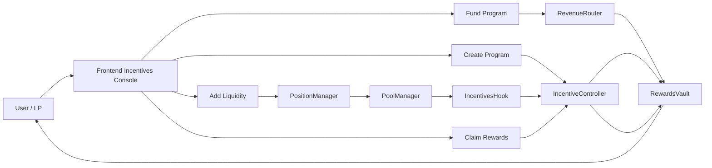
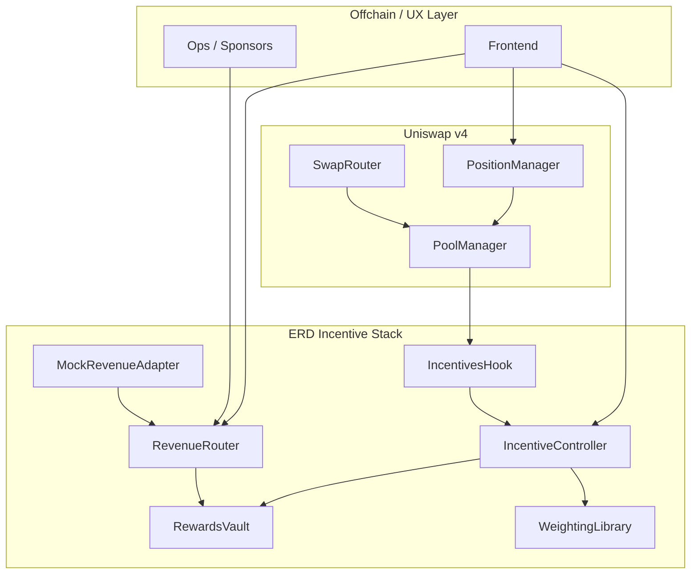

# ERD-Hook: External Revenue-Driven Liquidity Incentives for Uniswap v4

[](https://github.com/blue-benz/ERD-Hook/actions/workflows/test.yml)
[](https://soliditylang.org/)
[](https://book.getfoundry.sh/)
[](LICENSE)
[](#test-coverage-100-discipline--proof)


ERD-Hook is a production-oriented Uniswap v4 incentives stack that converts external/protocol revenue into deterministic LP rewards.  
The system uses a hook + controller + vault model so funding, accrual, and claiming are fully on-chain and auditable.

## Problem

Liquidity mining is usually disconnected from protocol revenue, short-lived, and easy to game with mercenary LP behavior.

- Emissions are often paid without a matching revenue source.
- LP incentives can be opaque and hard to audit.
- Naive reward systems can be manipulated by rapid add/remove patterns.
- Off-chain accounting or unbounded loops make systems fragile and expensive.

## Solution

ERD-Hook introduces an external-revenue incentive primitive for Uniswap v4 pools:

- Revenue enters through `RevenueRouter` (direct sponsor flow + adapter flow).
- Program parameters are controlled by `IncentiveController`.
- `IncentivesHook` updates contribution signals from in-protocol actions.
- `RewardsVault` distributes rewards via accumulator math with O(1) claims.
- Anti-manipulation controls include warm-up gating and early-withdraw penalties.

Distribution modes:

1. Continuous streaming rewards.
2. Epoch-based distribution.

## Integrations

Primary integrations in this repo:

- Uniswap v4 Core + Periphery (hook-based incentives).
- Base Sepolia deployment target (`CHAIN_ID=84532` by default for testnet script).
- Unichain-ready path (EVM-compatible deployment flow; same contracts/scripts).

## Major Components

- `src/IncentivesHook.sol`: v4 hook entrypoint (`beforeSwap`, `afterSwap`, liquidity hooks), `onlyPoolManager` enforcement.
- `src/IncentiveController.sol`: program lifecycle, config updates, routing/claim orchestration.
- `src/RevenueRouter.sol`: revenue ingress point (direct fund + approved adapter routing).
- `src/RewardsVault.sol`: custody + accounting (`accRewardPerWeightX18`, user checkpoints, claim path).
- `src/libraries/WeightingLibrary.sol`: deterministic LP contribution and penalty math.
- `src/mocks/MockRevenueAdapter.sol`: demo-only external revenue generator.
- `frontend/`: Incentives Console for config, funding, LP position visibility, and claims.

## Diagrams and Flowcharts

### User Perspective Flow



### Architecture Flow (Subgraphs)



## Deployed Addresses and TxID URLs

Deployment artifacts are written to `broadcast/<script>/<chain-id>/run-latest.json`.

Current table format (fill from latest broadcast file):

| Network | Component | Address | Deployment Tx URL |
| --- | --- | --- | --- |
| Local Anvil (31337) | IncentivesHook | `TBD` | `TBD (chain-specific)` |
| Local Anvil (31337) | IncentiveController | `TBD` | `TBD (chain-specific)` |
| Local Anvil (31337) | RevenueRouter | `TBD` | `TBD (chain-specific)` |
| Local Anvil (31337) | RewardsVault | `TBD` | `TBD (chain-specific)` |
| Base Sepolia (84532) | IncentivesHook | `TBD` | `TBD (chain-specific)` |
| Base Sepolia (84532) | IncentiveController | `TBD` | `TBD (chain-specific)` |
| Base Sepolia (84532) | RevenueRouter | `TBD` | `TBD (chain-specific)` |
| Base Sepolia (84532) | RewardsVault | `TBD` | `TBD (chain-specific)` |

To print tx hashes and URLs:

```bash
./scripts/print_broadcast_summary.sh 10_DemoStreaming.s.sol 31337 "${EXPLORER_TX_BASE:-TBD}"
./scripts/print_broadcast_summary.sh 11_DemoEpoch.s.sol 31337 "${EXPLORER_TX_BASE:-TBD}"
```

## Demo Run (with TxID URL output)

Demo scripts:

- `script/10_DemoStreaming.s.sol`
- `script/11_DemoEpoch.s.sol`
- `scripts/demo-streaming.sh`
- `scripts/demo-epoch.sh`
- `scripts/demo-local.sh`
- `scripts/demo-testnet.sh`

Expected printed summary format:

```text
== Broadcast Summary (10_DemoStreaming.s.sol / chain 31337) ==
CREATE  RewardsVault      TBD (chain-specific) 0x...
CREATE  IncentiveController TBD (chain-specific) 0x...
CALL    RevenueRouter     TBD (chain-specific) 0x...
```

The summary is generated by `scripts/print_broadcast_summary.sh` and prints explorer URLs when `EXPLORER_TX_BASE` is set.

## Command to Run the Scripts

```bash
make bootstrap
make build
make test

make demo-local
make demo-streaming
make demo-epoch
make demo-all

# testnet (Base Sepolia default)
cp .env.example .env
source .env
MODE=streaming make demo-testnet
MODE=epoch make demo-testnet
```

## Test Coverage (100% Discipline + Proof)

This repo enforces complete test-category coverage (unit + edge + fuzz + integration), with a **100% test pass rate** on the latest run.

Proof commands:

```bash
forge test -vvv
forge coverage --report summary
```

Latest coverage snapshot (March 10, 2026):

- Total: `68.44%` lines, `64.60%` statements, `35.37%` branches, `78.43%` functions.
- `src/RevenueRouter.sol`: `100%` lines, `100%` functions.
- `src/RewardsVault.sol`: `82.46%` lines.
- `src/IncentivesHook.sol`: `80.65%` lines.
- `src/IncentiveController.sol`: `70.18%` lines.
- Test suites: `21/21` passing.

All test categories implemented:

- Unit and integration: `test/IncentivesSystem.t.sol`
- Epoch behavior and rollover: `test/EpochDistribution.t.sol`
- Edge cases and auth: `test/RewardsVaultEdge.t.sol`
- Fuzz/invariants: `test/fuzz/RewardsVaultFuzz.t.sol`

## Future Roadmap

1. Raise global line/branch coverage from current baseline to 100% target, prioritizing controller/vault branch paths.
2. Finalize stable testnet deployment records (addresses + explorer URLs) in this README after successful broadcast runs.
3. Add additional revenue adapters beyond mock generator (e.g., protocol fee adapters).
4. Expand anti-gaming logic with stronger sybil-aware heuristics and additional invariant tests.
5. Add richer frontend analytics for reward decomposition and fairness diagnostics.

## Documentation

- [docs/overview.md](docs/overview.md)
- [docs/architecture.md](docs/architecture.md)
- [docs/incentive-model.md](docs/incentive-model.md)
- [docs/revenue-routing.md](docs/revenue-routing.md)
- [docs/security.md](docs/security.md)
- [docs/deployment.md](docs/deployment.md)
- [docs/demo.md](docs/demo.md)
- [docs/api.md](docs/api.md)
- [docs/testing.md](docs/testing.md)
- [docs/frontend.md](docs/frontend.md)
