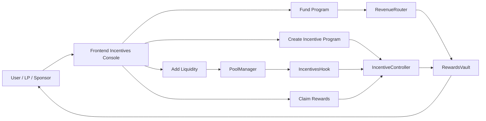
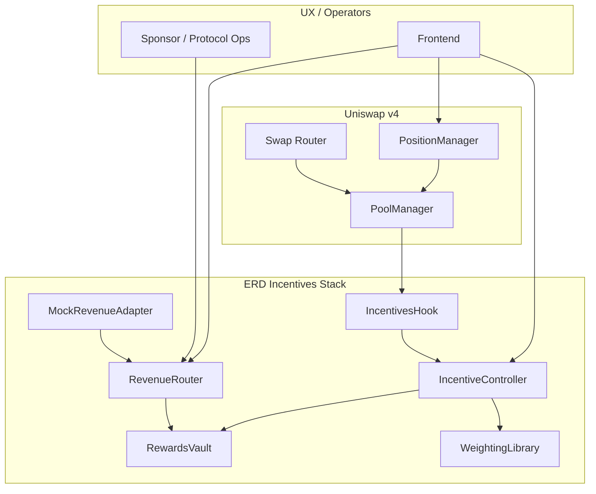
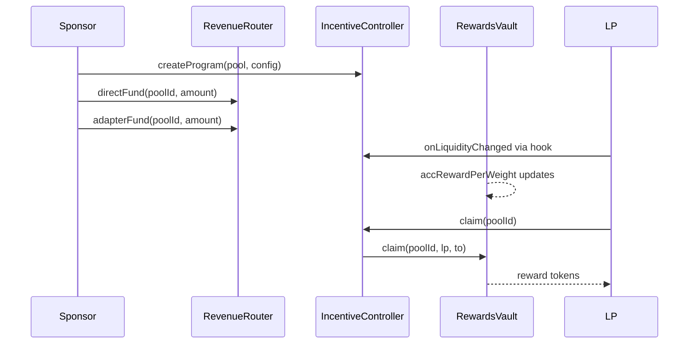

# ERD-Hook: External Revenue-Driven Liquidity Incentives for Uniswap v4

[](https://github.com/blue-benz/ERD-Hook/actions/workflows/test.yml)
[](#100-forge-coverage-proof)
[](https://soliditylang.org/)
[](https://book.getfoundry.sh/)
[](https://sepolia.uniscan.xyz/)
[](LICENSE)


ERD-Hook is a production-focused Uniswap v4 incentives system that routes external/protocol revenue into deterministic, on-chain LP rewards.

## Description

ERD-Hook introduces a reusable primitive for protocol-funded liquidity: revenue enters through auditable funding paths, reward accounting is deterministic, and LP claims are loop-free and on-chain.

## Problem

Most LP incentive systems have one or more of these failures:

- Funding is disconnected from real protocol revenue.
- Reward accounting is opaque or off-chain.
- Mercenary liquidity can farm emissions with fast in/out behavior.
- Distribution designs rely on unbounded loops or fragile bookkeeping.

## Solution

ERD-Hook solves this with a hook-centric incentives architecture:

- External revenue enters via `RevenueRouter` (direct sponsor funding + adapter funding).
- `IncentiveController` configures and governs pool programs.
- `IncentivesHook` updates contribution signals from v4 lifecycle events.
- `RewardsVault` performs accumulator-based accounting and O(1) claims.
- Anti-gaming controls are enforced on-chain (warm-up and cooldown penalty).

Supported program types:

1. Continuous streaming rewards.
2. Epoch-based rewards.

## Integrations

This repository integrates:

- Uniswap v4 Core and Periphery.
- Unichain Sepolia deployment path.
- Foundry-based deploy/test/demo pipeline.

Reactive Network integration is not present in this codebase and is intentionally not configured.

## Major Components

- `src/IncentivesHook.sol`: Hook entrypoints, PoolManager-gated accounting updates.
- `src/IncentiveController.sol`: Program creation, updates, epoch rolls, claims routing.
- `src/RevenueRouter.sol`: Revenue ingress, adapter allowlist, funding routes.
- `src/RewardsVault.sol`: Funding custody, reward accumulators, claim settlement.
- `src/libraries/WeightingLibrary.sol`: Deterministic weighting + penalty math.
- `src/mocks/MockRevenueAdapter.sol`: Demo revenue source.
- `frontend/`: Incentives console for config/funding/state/claims.

## Diagrams and Flowcharts

### User Perspective Flow



### Architecture Flow (Subgraphs)



### Incentive Lifecycle Sequence



## Deployed Addresses with Tx URLs (Unichain Sepolia)

### Streaming (Deploy-Only Demo, March 10, 2026)

| Component | Address | Deployment Tx |
| --- | --- | --- |
| IncentivesHook | `0x93c343dA9D192e445C5482D7F926Ea2881410AC0` | https://sepolia.uniscan.xyz/tx/0xed52f424b4f621f363847624f1a17e4c7abed6cac43af368c1fa8e3b989908d2 |
| IncentiveController | `0x4D3961b81ee14f081b3723b0f2fC49006279c4cb` | https://sepolia.uniscan.xyz/tx/0x3d45770751816a93ce66fd533c3ffb0085270f57d3f9c22765462a6a055dc707 |
| RevenueRouter | `0xDfc53496aaABa922865c8015b1eF8Deb30A57145` | https://sepolia.uniscan.xyz/tx/0x8f1844f407a0ebf433e2d6f53ba043e1516c0943c6fcee2bf1ca1212557787f6 |
| RewardsVault | `0x6e74305AA17F439B57d1D6D4d2373aa498a1309b` | https://sepolia.uniscan.xyz/tx/0x374c6b8c17a33316f04da4e7078de81559f4b8326be15b98781f3260b70bf70c |
| MockRevenueAdapter | `0x3c072Fd7E4335dD46b3Bf9a7638afc2dA9d9B442` | https://sepolia.uniscan.xyz/tx/0x1be6fd2bf62322a0a801cb64caad73eb9f7d17f0c9d05c8338ef55f69911e002 |
| Reward Token | `0xE3328aAf598F5eAbe02b9f4E6F4747500dA31941` | https://sepolia.uniscan.xyz/tx/0x5a9e9348069ef16d22ef0cfb5e37683215755f8587215591dca8a69cf747b9fe |

Key funding txs:

- Direct funding: https://sepolia.uniscan.xyz/tx/0xd543c4a54fc3122d00fc9c7a72466ff7aa4cb365e8ca80da751655ccb15bc929
- Adapter funding: https://sepolia.uniscan.xyz/tx/0x3fba925c9a5cb5028b4acf5cf5452e96ceb6c12f439d5661076cf76b7837811e

### Epoch (Deploy-Only Demo, March 10, 2026)

| Component | Address | Deployment Tx |
| --- | --- | --- |
| IncentivesHook | `0x244C4De7f64532B5c7A50f3CE86Ffc4d49FD4ac0` | https://sepolia.uniscan.xyz/tx/0x4a15b9809b6508402e574f833aa0df26bad8510d689728ab503cd342a8224ff8 |
| IncentiveController | `0x118d2D59dDC07e72Ea765da49855397bdF073910` | https://sepolia.uniscan.xyz/tx/0x379a15d45ab8bbdf680c6cf92c6c324dfe18cc7545ec986952d682ca9085b960 |
| RevenueRouter | `0x35A601b5D57a9768418126DeA167edCd67AAF3Df` | https://sepolia.uniscan.xyz/tx/0xb722f3ee5cdaf63067fac4dea7bd234a0646424b6e3db0dfa8b445132aa40b60 |
| RewardsVault | `0x3A23183EE72D9A66E32955A7cd39a31ccA517C46` | https://sepolia.uniscan.xyz/tx/0xded23cf03304f3075926fc5910a9ff9b427e29897ac832ce62fc286d91a5dcd5 |
| MockRevenueAdapter | `0xd13DfC5a12d30134847166f3a562803A4470c74c` | https://sepolia.uniscan.xyz/tx/0x63d6b792d3cdf146548c4e695c5967397299f029e05c2d43acb91aaaa25f8db4 |
| Reward Token | `0x5618F0911EC60d088F63A74d1fed92e9f3743d47` | https://sepolia.uniscan.xyz/tx/0x5751374ffc63e9d3b55f140067ddfd2f66b3ec9c14bf45384864c680c289850c |

## Demo Run

### Full Lifecycle Demo (Local)

- `scripts/demo-streaming.sh`
- `scripts/demo-epoch.sh`
- `scripts/demo-local.sh`

These run the full lifecycle: deploy -> configure -> fund -> LP A joins -> LP B joins -> swap -> claim.

`scripts/demo-local.sh` runs streaming and epoch on isolated Anvil nodes (`--block-time 1`) to avoid CREATE2 collisions and ensure deterministic local accrual.

### Testnet Demo (Unichain Sepolia)

- `scripts/demo-testnet.sh` defaults to `TESTNET_DEPLOY_ONLY=true` for stable broadcast sequencing.
- Set `TESTNET_DEPLOY_ONLY=false` to attempt full lifecycle on public RPC.

Tx URLs are printed automatically by `scripts/print_broadcast_summary.sh`.
The script also prints an on-chain `Claim Event Summary` (decoded from tx receipts), which is the authoritative proof of claimed amounts.

## Commands to Run

```bash
make bootstrap
make build
make test

# Full local lifecycle demos
make demo-streaming
make demo-epoch
make demo-local
make demo-all

# Unichain Sepolia deploy-only demos (default)
MODE=streaming ./scripts/demo-testnet.sh
MODE=epoch ./scripts/demo-testnet.sh

# Optional: full public lifecycle attempt
TESTNET_DEPLOY_ONLY=false MODE=streaming ./scripts/demo-testnet.sh
```

## 100% Forge Coverage Proof

Coverage command used:

```bash
forge coverage --report summary --no-match-coverage "script|test"
```

Latest result (March 10, 2026):

- Total Lines: `100.00% (348/348)`
- Total Statements: `100.00% (387/387)`
- Total Branches: `100.00% (66/66)`
- Total Funcs: `100.00% (63/63)`

Test categories included:

- Unit tests.
- Edge case tests.
- Fuzz/invariant tests.
- Integration/system tests.
- Library behavior tests.

## Future Roadmap

1. Add additional production revenue adapters (beyond mock adapter).
2. Add richer frontend fairness analytics and LP attribution breakdowns.
3. Introduce governance delay/timelock hardening for sensitive config updates.
4. Extend anti-gaming invariants and MEV-aware stress scenarios.
5. Publish post-deploy monitoring runbook and alerting checklist.

## Documentation

- [docs/overview.md](docs/overview.md)
- [docs/architecture.md](docs/architecture.md)
- [docs/incentive-model.md](docs/incentive-model.md)
- [docs/revenue-routing.md](docs/revenue-routing.md)
- [docs/security.md](docs/security.md)
- [docs/deployment.md](docs/deployment.md)
- [docs/demo.md](docs/demo.md)
- [docs/api.md](docs/api.md)
- [docs/testing.md](docs/testing.md)
- [docs/frontend.md](docs/frontend.md)
