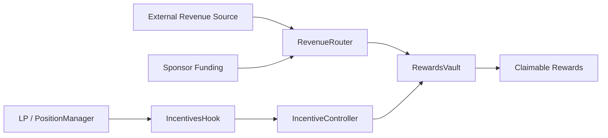

# Architecture

## Components

- `IncentivesHook`: Uniswap v4 hook entrypoint (`beforeAddLiquidity`, `beforeRemoveLiquidity`, `beforeSwap`, `afterSwap`).
- `IncentiveController`: program registry, queue/execute config updates, hook-authenticated accounting entrypoint.
- `RevenueRouter`: direct sponsor funding + approved adapter funding.
- `RewardsVault`: token custody and deterministic per-weight reward accounting.
- `MockRevenueAdapter`: demo external revenue source.

## Data Flow

## Control Plane

- Owner creates program from `PoolKey`.
- Config changes are delayed via queue/execute in `IncentiveController`.
- Hook callbacks are accepted only from PoolManager and then only from configured hook address into controller.
