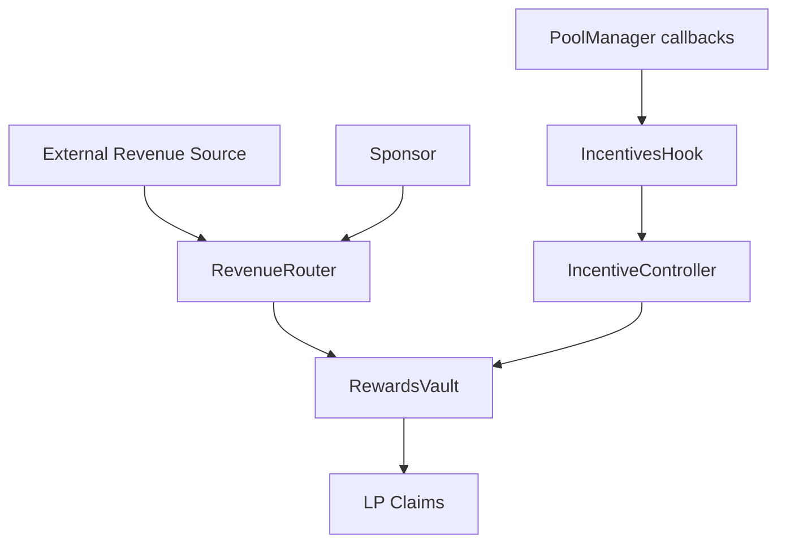
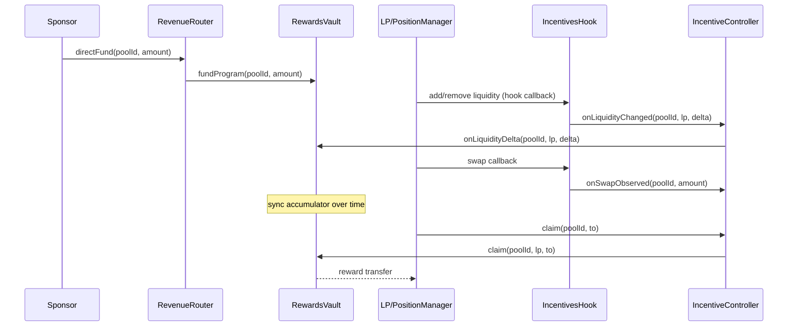
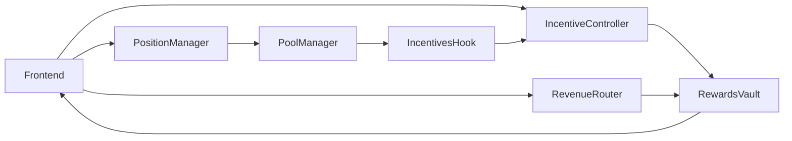

# ERD-Hook Specification

## 1. Scope

ERD-Hook is a new on-chain incentive primitive for Uniswap v4 pools.

- Funding source: external/protocol revenue (including demo adapters).
- Reward policy: deterministic, accumulator-based, auditable.
- Security posture: bounded gas, access control, anti-gaming controls.

This implementation is inspired by Liquity/BOLD revenue-funded incentives as a design direction, not as a code or mechanism copy.

## 2. Design Goals

1. Deterministic accounting.
2. No iteration over all LPs.
3. Revenue-funded rewards (direct + adapter).
4. Support both continuous and epochal distributions.
5. Hook-safe architecture consistent with v4 callback constraints.

## 3. Components

- `IncentivesHook`
- `IncentiveController`
- `RevenueRouter`
- `RewardsVault`
- `WeightingLibrary`
- `MockRevenueAdapter`

## 4. High-Level Architecture

## 5. Lifecycle Sequence

## 6. Interaction Diagram

## 7. Incentive Accounting

### 7.1 Program State

For each pool program:

- `fundedBalance`
- `totalFunded`
- `emissionRate`
- `accRewardPerWeightX18`
- `totalActiveWeight`
- `totalPendingWeight`
- `totalDistributed`
- `totalClaimed`
- `totalSlashed`

### 7.2 User State

- `activeWeight`
- `pendingWeight`
- `pendingActivation`
- `lastStakeIncrease`
- `rewardDebtX18`
- `pendingRewards`

### 7.3 Equations

1. `rewards = min((to - from) * emissionRate, fundedBalance)`
2. `accRewardPerWeightX18 += rewards * 1e18 / totalActiveWeight`
3. `pendingRewards += activeWeight * acc / 1e18 - rewardDebt`

### 7.4 Distribution Modes

- Streaming mode: continuous emission.
- Epoch mode: emissions constrained to `[startTime, endTime]`, with explicit `rollEpoch`.

## 8. Anti-Gaming

- Warm-up activation (`pendingWeight` -> `activeWeight`).
- Cooldown penalty on fast withdrawals (`earlyWithdrawalPenaltyBps`).
- No unbounded loops in update/claim paths.

## 9. Security Controls

- Hook callback source restriction via `BaseHook.onlyPoolManager`.
- Controller callback source restriction via `onlyHook`.
- Program updates delayed by queue/execute.
- Reentrancy lock on claims.
- Reward token immutable per program after creation.

## 10. Dependency Reproducibility

- Bootstrap script: `scripts/bootstrap.sh`.
- Pinned commit enforced: `v4-periphery` at `3779387`.
- Root `v4-core` aligned to the pinned periphery submodule pointer.
- CI executes bootstrap and fails on mismatch.

## 11. Assumptions

1. LP identity is passed in hook data (`abi.encode(lpAddress)`).
2. Governance owner is trusted to create and update programs under delay.
3. Testnet explorer URL may be chain-specific and is printed as `TBD` when unset.

## 12. Non-Goals

- Off-chain accounting.
- Enumeration of all LPs on-chain.
- Guarantee against all sybil/address splitting behavior.
